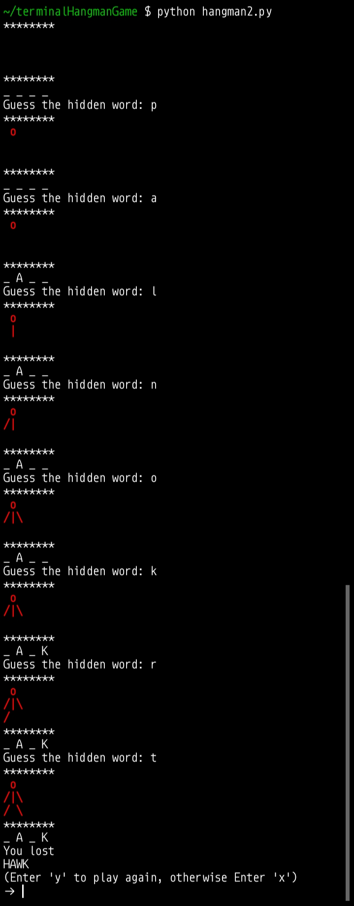

# hangmanGame-terminal
A python terminal hangman game

# How to play
- Guess the correct word before the man is fully formed/created.
- Each incorrect guess generates 1 body part of the man (starting with the head: o, then the body: |, and so on)
- the only hint you have is the total number of blank (_).
- Example hidden word: Apple (5 letters) therefore "Apple" is equivalent to 5 blanks "_ _ _ _ _"

# Customization
- You can remove all the words in hangman_words.py and replace it to whatever words you want, there's no limit to it.

# Gameplay Screenshot

